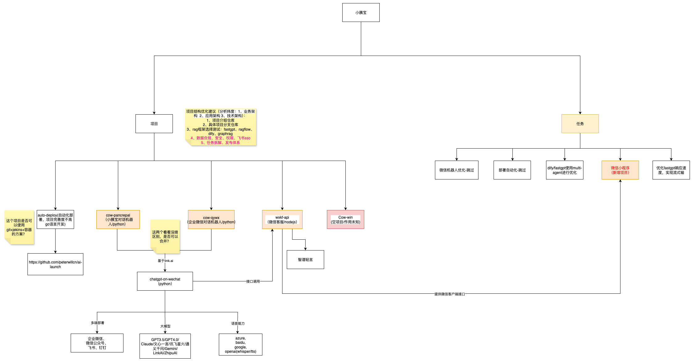

# 2025年9月7号架构讨论会

时间：205年9月7号 20:00-21:00

地点：腾讯会议

参与人：晓强、胡卿、麦仔

会议内容：

（1）胡卿分享：

（2）麦仔分享：

- 现有项目分析，结构梳理等
- 现有项目存在问题如何处理讨论
- 讨论未来项目如何规划

（3）晓强分享：

总结：

- 项目结构优化：需要从业务架构、应用架构、技术架构纬度分析项目对项目进行合理规划，大概分为项目介绍主仓库、具体项目分支仓库。项目主仓库介绍项目，按照业务、应用、技术层面分类管理，方便志愿者能快速了解项目，根据自己技术能力选择合适的项目进行贡献

- RAG框架选择测试、选择更合适的技术框架，目前选型有：

  - fastgpt（目前在使用）：https://github.com/labring/FastGPT
  - ragflow：https://github.com/infiniflow/ragflow
  - dify：https://github.com/langgenius/dify/
  - graphrag：https://github.com/microsoft/graphrag

- 小X宝的任务拆解、发布体系需要完备，流程需要规范

  