# 社区应用原则
- 社区公益推动的是长周期病情的patient-care（患者管理），通过社群+应用+AI能力，让患者/家属在全程的关键节点，都能有公益性的服务和AI应用，降低信息差，提升全程患者自我管理的质量和收益。
- 商业化的应用已经在做，或者做好的，不要去开发，成本代价不对等，大概率失败
- 开发思路是先做轻应用，后面让应用，开源开发团队，和用户互动，真的有价值的应用会继续迭代，而不完善的应用，会停止更新，保留努力的成果。
- 社区业务架构，技术架构和生态环境，适合大量的轻应用，1-2个人就可以开发，维护，而社区的价值，是把应用和用户连接起来，做协调员
- 不排斥商业化，但是守住社区基本原则，不应该向患者收费。
- 这个决定权，交给贡献者，社区是纯公益的

# app说明结构：
| 社区应用 | Info问题 & 程度 | User_story |
| -------- | --------------- | ---------- |

# 主线一：临床支持 （R1）
# 阶段1  早筛(A)

- A1: 早筛小程序：
   功能：提供肿瘤早筛的垂直服务
   * 通过多轮回答 + 肿瘤早筛的AI助手 + 指南文档 + 推荐医疗机构
   * 打开即用，链接到社区合作基因/医院的公益性质检测内容

# 阶段2 首诊(B)

- B1: 小胰宝 + 基础群： 
    功能：提供肿瘤首诊的信息快速支持
    * 小胰宝：通过多轮回答 + 提供点对点咨询
    * 新手宝典：提供患者最关心的问题和规范引导
    * 社群：提供人文支持，在心理支持 + 诊疗规范引导方面，发挥人-人沟通的价值

- B2: 病情导航小程序
病情导航小程序
├── 📊 我的病情地图（当前状态、可能路径）
├── 🛤️ 经历路径（指南规范）
├── ⚖️ 决策工具（治疗选择）
└── 🏠 资源地图（医疗资源/知识资源/社群资源/心理&营养支持资源等）

# 阶段3  二线(C)

- C1: 专业咨询PRO群 + 小胰宝 + KnowS群：
    功能：提供专业的肿瘤咨询分级服务
    * 专业医生：提供专业的肿瘤咨询科普，比如视频号，科普文章和义诊
    * 蓝马甲专业患者团队：提供专业的肿瘤信息讨论，意见和信息分享，
    * 专业AI能力：提供全方位的AI点对点信息支持，从科普（小胰宝），到文献（knows），再到深度研究

- C2: 病友案例库：基于个人授权，分享患者的真实案例，包括病情描述、治疗和处置过程、结果和心得等。数据全脱敏，并提示不可作为医疗对比
💡 "经验库"而非"知识库"：适合get笔记
- 患者真实经历的故事库
- 情感历程的分享空间
- "一路走来"的实用小贴士
- 收藏夹式的资源整理

# 阶段4 后线（D）

- D1: 临床咨询群 + get知识库 + 小胰宝：
    功能：提供专业的肿瘤咨询分级服务
    * 专业医生：提供专业的肿瘤咨询服务，
    * 专业团队：提供专业的肿瘤咨询服务
    * 专业社群：提供专业的肿瘤咨询服务

# 阶段6  并发症管理（E）

- E1: 小红卡，提供多种并发症的自我管理，通过一张图，解决从预警常识-应对策略-自我准备的完整应对策略
    功能：提供专业的肿瘤并发症管理服务
    * 专业团队：提供专业的肿瘤并发症管理服务
    * 专业社群：提供专业的肿瘤并发症管理服务

# 主线二： 营养支持（R2）

- F1: 小食宝 + 基础群： 
    功能：提供患者的营养支持
    * 小胰宝：通过多轮回答 + 提供点对点咨询
    * 新手宝典：提供患者最关心的问题和规范引导
    * 社群：提供人文支持，在心理支持 + 诊疗规范引导方面，发挥人-人沟通的价值

# 主线三： 心理支持（R3）

- G1: 心理支持群 + 小馨 + 线上心理支持小组工作坊：
    功能：提供患者的心理支持
    * 心理支持群：提供患者的心理支持，在心理支持 + 诊疗规范引导方面，发挥人-人沟通的价值
    * 小馨宝：专业心理咨询调优，提供1v1多轮回答 + 提供心理陪伴和支持，效果得到心理专业老师的认可

- G2：心理导航图：分别提供患者/家属，从确诊的心理导航指引

## | mermaid流程图 | 
> [A = APPs, T = 工具Tools，C = 社群Community]
---

```mermaid
graph LR
    Start[新患者] --> R1[M1:临床支持]
    R1 --> R1A[早筛]
    R1A --> R1A1[A:早筛小程序]
    R1A --> R1B[首诊]
    R1B --> R1B1[C:小胰宝基础群]
    R1B --> R1B2[T:新手Wiki宝典]
    R1B --> R1B3["T:新手小程序 待定"]
    R1B --> R1C[二线]
    R1C --> R1C0[A:小胰宝AI助手]
    R1C --> R1C1[C:小胰宝PRO群]
    R1C --> R1C2[C:小胰宝KnowS群]
    R1C --> R1C3[C:小胰宝x复旦x瑞金x外部胰腺病友..合作群]
    R1C --> R1D[后线]
    R1D --> R1D1[C:临床咨询群知识库小胰宝]
    R1D --> R1D2[T:临床测试一手信息知识库]
    R1D --> R1D3["A:放疗全程AI助手 待定"]
    R1D --> R1D4["C:PRO放疗群 待定"]
    R1D --> R1E[并发症管理]
    R1E --> R1E1[A:小红卡并发症]
    R1E --> R1E2["A:小胰宝AI助手 并发症模块"]
    R1E --> R1E3[C:梗阻病友社群]
    R1E --> R1E4[C:消化道出血社群]
    R1E --> R1E5[C:感染社群]
    R1E --> R1E6[C:...]
    R1E --> R1F[安宁疗护]
    R1F --> R1F1[C:安宁疗护支持群]
    R1F --> R1F2[T:安宁疗护资源wiki]
    Start[新患者] --> R2[M2:营养支持]
    R2 --> R2F["A:小胰宝AI助手 营养模块"]
    R2 --> R2G[C:营养快车群]
    Start[新患者] --> R3[M3:心理支持]
    R3 --> R3G[A:小馨宝AI助手小程序]
    R3 --> R3H[C:线上心理支持小组工作坊]
    R3 --> R3I[C:蓝马甲AI心理支持群]
    R1 --> R10[M4:病情导航支持]
    R10 --> R10A[A:病情导航小程序]
    R10 --> R10B[T：开放知识库OpenKb]
    R10B --> R10B1[T:并发症wiki]
    R10B --> R10B2[T:get笔记知识库矩阵]
    R10B --> R10B3[T:社区白皮书]

    %% 样式定义
    style Start fill:#bbf,stroke:#333,stroke-width:2px
    %% 主要节点样式 - 使用紫红色
    style R1 fill:#81c7d4,stroke:#333,stroke-width:4px
    style R2 fill:#81c7d4,stroke:#333,stroke-width:4px
    style R3 fill:#81c7d4,stroke:#333,stroke-width:4px
    style R10 fill:#81c7d4,stroke:#333,stroke-width:4px
    style R1A fill:#bbf,stroke:#333,stroke-width:2px
    style R1B fill:#bbf,stroke:#333,stroke-width:2px
    style R1C fill:#bbf,stroke:#333,stroke-width:2px
    style R1D fill:#bbf,stroke:#333,stroke-width:2px
    style R1E fill:#bbf,stroke:#333,stroke-width:2px
    style R1F fill:#bbf,stroke:#333,stroke-width:2px

 

    %% Apps(A)类节点样式 - 使用浅绿色
    style R1A1 fill:#cfc,stroke:#333,stroke-width:2px
    style R1C0 fill:#cfc,stroke:#333,stroke-width:2px
    style R1D3 fill:#cfc,stroke:#333,stroke-width:2px
    style R1E1 fill:#cfc,stroke:#333,stroke-width:2px
    style R1E2 fill:#cfc,stroke:#333,stroke-width:2px
    style R2F fill:#cfc,stroke:#333,stroke-width:2px
    style R3G fill:#cfc,stroke:#333,stroke-width:2px
    style R10A fill:#cfc,stroke:#333,stroke-width:2px


    %% 社群(C)类节点样式 - 使用浅灰色
    style R1B1 fill:#eee,stroke:#333,stroke-width:2px
    style R1C1 fill:#eee,stroke:#333,stroke-width:2px
    style R1C2 fill:#eee,stroke:#333,stroke-width:2px
    style R1C3 fill:#eee,stroke:#333,stroke-width:2px
    style R1D1 fill:#eee,stroke:#333,stroke-width:2px
    style R1D4 fill:#eee,stroke:#333,stroke-width:2px
    style R1E3 fill:#eee,stroke:#333,stroke-width:2px
    style R1E4 fill:#eee,stroke:#333,stroke-width:2px
    style R1E5 fill:#eee,stroke:#333,stroke-width:2px
    style R1E6 fill:#eee,stroke:#333,stroke-width:2px
    style R1F1 fill:#eee,stroke:#333,stroke-width:2px
    style R2G fill:#eee,stroke:#333,stroke-width:2px
    style R3H fill:#eee,stroke:#333,stroke-width:2px
    style R3I fill:#eee,stroke:#333,stroke-width:2px

    %% 工具(T)类节点样式 - 使用浅黄色
    style R1B2 fill:#ffd,stroke:#333,stroke-width:2px
    style R1B3 fill:#ffd,stroke:#333,stroke-width:2px
    style R1D2 fill:#ffd,stroke:#333,stroke-width:2px
    style R1F2 fill:#ffd,stroke:#333,stroke-width:2px
    style R10B fill:#ffd,stroke:#333,stroke-width:6px
    style R10B1 fill:#ffd,stroke:#333,stroke-width:2px
    style R10B2 fill:#ffd,stroke:#333,stroke-width:2px
    style R10B3 fill:#ffd,stroke:#333,stroke-width:2px
```

